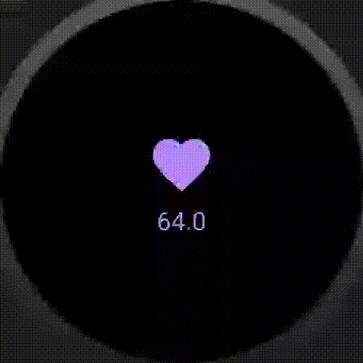

# Beat Follower

This app aims to demonstrate how we can build an app for Android Wear
using Health Services API to track the heartbeat rate and display it in
a UI built using Jetpack Compose.

## Demo

## App Architecture

*To be written...*

## How can I run this app?

*To be written...*

## Want to know more?

*Soon there will be a link for an article...*
